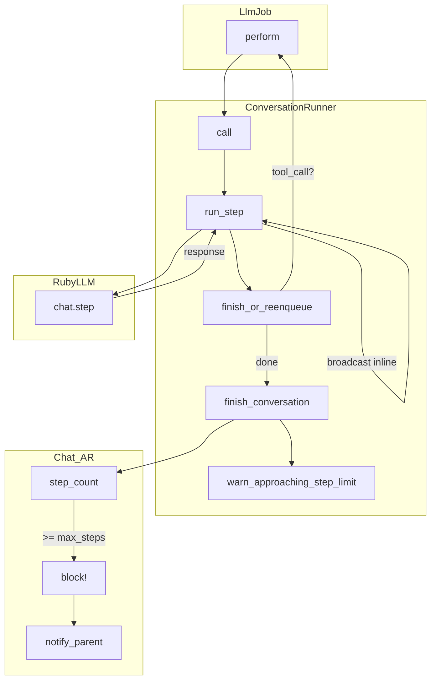

# chat.step — Shaping

## Requirements (R)

| ID | Requirement | Status |
|----|-------------|--------|
| R0 | Prevent sub-agents from rabbitholin — parent can course-correct when limit is hit | Core goal |
| R1 | Each LLM call is observable and broadcastable individually | Must-have |
| R2 | A failed broadcast does not break the conversation | Must-have |
| R3 | No watermark / "find messages since ID" heuristic | Must-have |
| R4 | Minimal fork surface in RubyLLM | Must-have |
| R5 | `max_steps` caps total LLM API calls — fires `notify_parent_of_termination` when hit | Must-have |

---

## A: Fork RubyLLM — add `chat.step`

| Part | Mechanism |
|------|-----------|
| A1 | Add `Chat#step` to RubyLLM: one provider call, execute tools, return response (no recursion) |
| A2 | `ConversationRunner` calls `chat.step` once per job |
| A3 | After step: broadcast the response inline (no `BroadcastMessagesJob`) |
| A4 | If `response.tool_call?` → re-enqueue `LlmJob`; else → `finish_conversation` |
| A5 | `step_count` derived: `messages.assistant.since_id(last_visible_user_message_id).count` — resets naturally when user/parent sends a message; no DB column |
| A6 | When `steps_remaining == 3` → inject invisible user message nudging agent to call `report_back` |
| A7 | When `step_count >= max_steps` → block chat + fire `notify_parent_of_termination` |
| A8 | Agent YAML: rename `max_turns` → `max_steps`; `turn_count` column dropped |

---

## Fit Check: R × A

| Req | Requirement | Status | A |
|-----|-------------|--------|---|
| R0 | Prevent sub-agents from rabbitholin — parent can course-correct when limit is hit | Core goal | ✅ |
| R1 | Each LLM call is observable and broadcastable individually | Must-have | ✅ |
| R2 | A failed broadcast does not break the conversation | Must-have | ✅ |
| R3 | No watermark / "find messages since ID" heuristic | Must-have | ✅ |
| R4 | Minimal fork surface in RubyLLM | Must-have | ✅ |
| R5 | `max_steps` caps total LLM API calls — fires `notify_parent_of_termination` when hit | Must-have | ✅ |

**Notes:**
- R0: A7 blocks + notifies parent when `step_count >= max_steps`; A6 nudges agent to `report_back` at 3 remaining
- R1: A2+A3 — each job is one LLM call, broadcast inline immediately after
- R2: A3 broadcasts inline but failure doesn't affect `ConversationRunner` flow
- R3: A3 — response is right there in the job, no watermark needed; `BroadcastMessagesJob` goes away
- R4: A1 adds one method to `Chat` — no changes to provider layer, tool execution, or message handling
- R5: A5+A6+A7 — `step_count` derived from assistant message count, checked each job

---

## Detail A: Breadboard

### CURRENT

| Place | Affordance | Wires Out |
|-------|------------|-----------|
| **LlmJob** | `perform(chat)` | → ConversationRunner.call |
| **ConversationRunner** | `call(chat)` | → start_conversation, configure_llm, capture `last_message_id`, run_llm, BroadcastMessagesJob, finish_conversation |
| **ConversationRunner** | `run_llm` | → `chat.complete` (loops until no tool calls) |
| **ConversationRunner** | `finish_conversation` | → increment `turn_count`, check `max_turns`; if hit → `chat.block!` + notify_parent |
| **ConversationRunner** | `warn_approaching_turn_limit` | → inject invisible user message at `remaining == 3` |
| **BroadcastMessagesJob** | `perform(chat, last_message_id)` | → broadcast all messages with `id > last_message_id` |
| **RubyLLM::Chat** | `complete` | → provider call → if tool_call? recurse; else return |

### Detail A

| Place | Affordance | Wires Out |
|-------|------------|-----------|
| **LlmJob** | `perform(chat)` | → ConversationRunner.call |
| **ConversationRunner** | `call(chat)` | → start_conversation, configure_llm, run_step, finish_or_reenqueue |
| **ConversationRunner** | `run_step` | → `chat.step`; broadcast response inline |
| **ConversationRunner** | `finish_or_reenqueue` | → if `response.tool_call?` → `LlmJob.perform_later`; else → finish_conversation |
| **ConversationRunner** | `finish_conversation` | → check `step_count` vs `max_steps`; if hit → `chat.block!` + notify_parent |
| **ConversationRunner** | `warn_approaching_step_limit` | → inject invisible user message at `steps_remaining == 3` |
| **RubyLLM::Chat** | `step` *(new)* | → one provider call → execute tools if any → return response (no recursion) |
| **Chat (AR)** | `step_count` *(derived)* | → `messages.assistant.since_id(last_visible_user_message_id).count` |
| ~~BroadcastMessagesJob~~ | ~~removed~~ | |

---

## Follow-ups

| # | Task |
|---|------|
| F1 | Document chat hierarchy and message flow with diagrams — how chats nest, role conventions per chat, how system injections (`notify_parent_of_termination`, step-limit nudge) appear to the model vs. the UI |
