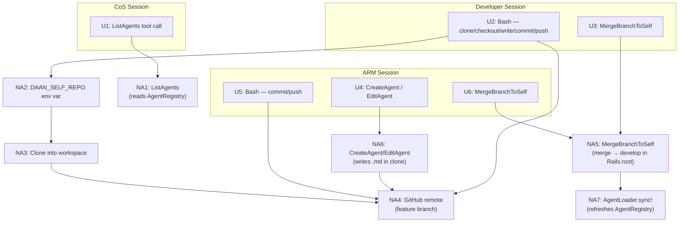

# Smooth Self-Modification — Shaping

## Source

> I would like to discuss how self-modification can work more smoothly and with less hiccups. The agents are already given a prompt that makes them more self aware. So when they're asked to "add a new team member", they should know what that means. How self-mod happens in development vs production should be different. In production, it should always make a PR in DAAN_SELF_REPO. A human may merge the change later. In development, I want it to update itself, but not directly: it will make the change in the workspace, then pull those changes in the app's working directory so it can be seen immediately. Maybe github's still used, sure, but for now just as a place to put the branch and then maybe there's a special tool like "UpdateSelfRepoToRef('commit ref or branch')".
>
> I'm not opposed to keeping CreateAgent/EditAgent because it allows for structured writing of files. We can build in more validation.
>
> Agent editing capabilities are done by the Agent Resource Manager who currently doesn't have git access. But this feature I'm proposing isn't just for new agents, but for new features I want to be able to immediately see locally. I want to use the app to dogfood -- use the app to develop itself.

---

## Problem

Self-modification is awkward in two ways:

1. **No git discipline** — `CreateAgent`/`EditAgent` write directly to the running app's files. There's no branch, no review, no trace. This works for tiny experiments but breaks down when multiple agents are making changes concurrently, and makes the dev/prod distinction meaningless.

2. **CoS can't discover team capabilities** — When a new agent is added, the CoS doesn't know about it until its own prompt is manually updated. This makes self-modification partly self-defeating.

---

## Outcome

Agents self-modify through git in all environments. In development, changes are visible immediately after push. In production, changes wait for human PR approval. The CoS discovers team capabilities dynamically — adding a new agent is enough for the CoS to know it exists.

The app can be used to develop itself (dogfooding): the developer agent pushes a branch, `MergeBranchToSelf` pulls it into the running app, Rails reloads the code.

---

## Requirements (R)

| ID | Requirement | Status |
|----|-------------|--------|
| R0 | Agents never write self-modification changes directly to the running app — all changes go through git in their workspace clone | Core goal |
| R1 | In production, self-modifications are proposed as PRs targeting `main` — a human merges | Must-have |
| R2 | In development, self-modifications are visible immediately after push, without a manual deploy | Must-have |
| R3 | Multiple concurrent self-modification tasks don't conflict | Must-have |
| R4 | No runtime environment check in agent code — tool availability determines the workflow | Must-have |
| R5 | `CreateAgent`/`EditAgent` remain as structured, validated helpers for writing agent definition files | Nice-to-have |
| R6 | CoS can discover team capabilities dynamically — new agents are visible without manually updating the CoS prompt | Must-have |

---

## A: Config-gated dev sync via develop branch

| Part | Mechanism |
|------|-----------|
| A1 | `DAAN_SELF_REPO` env var — the GitHub repo agents clone for self-modification (e.g. `ramontayag/daan-rails`) |
| A2 | `MergeBranchToSelf(branch)` tool — `git fetch && git checkout develop && git merge origin/<branch>` in `Rails.root`, then `AgentLoader.sync!` |
| A3 | `config/agents/developer.md` and `config/agents/agent_resource_manager.md` overrides add `MergeBranchToSelf` in dev; base definitions (prod) do not |
| A4 | Tool description on `MergeBranchToSelf` carries the "when to use this" guidance — no env branching in prompts |
| A5 | `CreateAgent`/`EditAgent` kept as structured helpers — used within workspace clone, never against `Rails.root` |
| A6 | `Daan::Core::ListAgents` tool — reads `AgentRegistry` and returns each agent's name, description, and tool list. Added to CoS's tool list. |

### Role boundaries

- **Developer** — writes any Ruby code, any file, full git access + `MergeBranchToSelf` (dev)
- **ARM** — writes agent definition files only via `CreateAgent`/`EditAgent`, git access for committing/pushing those files + `MergeBranchToSelf` (dev). No raw `Write` tool.
- **CoS** — orchestrates cross-domain work (e.g. new agent requiring a new tool: tells Developer to add the tool first, then tells ARM to create the agent). Calls `ListAgents` to discover team capabilities.

---

## Fit Check: R × A

| Req | Requirement | Status | A |
|-----|-------------|--------|---|
| R0 | Agents never write self-modification changes directly to the running app | Core goal | ✅ |
| R1 | Production self-modifications are PRs targeting `main` | Must-have | ✅ |
| R2 | Dev self-modifications visible immediately after push | Must-have | ✅ |
| R3 | Concurrent self-modification tasks don't conflict | Must-have | ✅ |
| R4 | No runtime env check — tool availability determines workflow | Must-have | ✅ |
| R5 | `CreateAgent`/`EditAgent` remain as structured helpers | Nice-to-have | ✅ |
| R6 | CoS can discover team capabilities dynamically | Must-have | ✅ |

**Notes:**
- R3 satisfied by the `develop` branch as integration point — each task merges its feature branch into `develop` independently
- R4 satisfied by A3 — the agent definition is the gate, zero `Rails.env` checks anywhere
- R1 satisfied by absence: prod definitions don't include `MergeBranchToSelf`, so agents fall through to `gh pr create`

---

## Detail A: Breadboard

### UI Affordances

| # | Place | Affordance | Wires Out |
|---|-------|------------|-----------|
| U1 | Chat — CoS thread | `ListAgents` tool call block (observable) | → NA1 |
| U2 | Chat — Developer thread | Bash tool call blocks: clone, checkout, write, commit, push | → NA3, NA4 |
| U3 | Chat — Developer thread | `MergeBranchToSelf` tool call block | → NA5 |
| U4 | Chat — ARM thread | `CreateAgent`/`EditAgent` tool call blocks | → NA6 |
| U5 | Chat — ARM thread | Bash tool call blocks: commit, push | → NA4 |
| U6 | Chat — ARM thread | `MergeBranchToSelf` tool call block | → NA5 |

### Non-UI Affordances

| # | Place | Affordance | Wires Out |
|---|-------|------------|-----------|
| NA1 | `Daan::Core::ListAgents` | New tool — reads `AgentRegistry`, returns name + description + tools for each agent | → CoS LLM context |
| NA2 | `DAAN_SELF_REPO` env var | Config — GitHub repo identifier agents clone for self-modification | → NA3 |
| NA3 | Developer workspace | `gh repo clone $DAAN_SELF_REPO` via existing Bash tool — clone lives in `tmp/workspaces/developer/` | → NA4 |
| NA4 | GitHub remote | Feature branch pushed via `git push` (Bash) | → NA5 (dev) or PR (prod) |
| NA5 | `Daan::Core::MergeBranchToSelf` | New tool — `git fetch && git checkout develop && git merge origin/<branch>` in `Rails.root`, then `AgentLoader.sync!` | → NA7 |
| NA6 | ARM workspace | `CreateAgent`/`EditAgent` write agent `.md` files into cloned repo at `lib/daan/core/agents/` | → NA4 |
| NA7 | `AgentLoader.sync!` | Existing — re-reads agent definition files from disk, refreshes `AgentRegistry` | → AgentRegistry |
| NA8 | `config/agents/developer.md` | Dev override — adds `MergeBranchToSelf` to Developer's tool list | → NA5 |
| NA9 | `config/agents/agent_resource_manager.md` | Dev override — adds `allowed_commands: [git, gh]`, `Daan::Core::Bash`, `MergeBranchToSelf` to ARM | → NA5, NA6 |
| NA10 | `lib/daan/core/agents/chief_of_staff.md` | Updated base definition — adds `Daan::Core::ListAgents` to CoS tool list | → NA1 |

### Wiring Diagram

